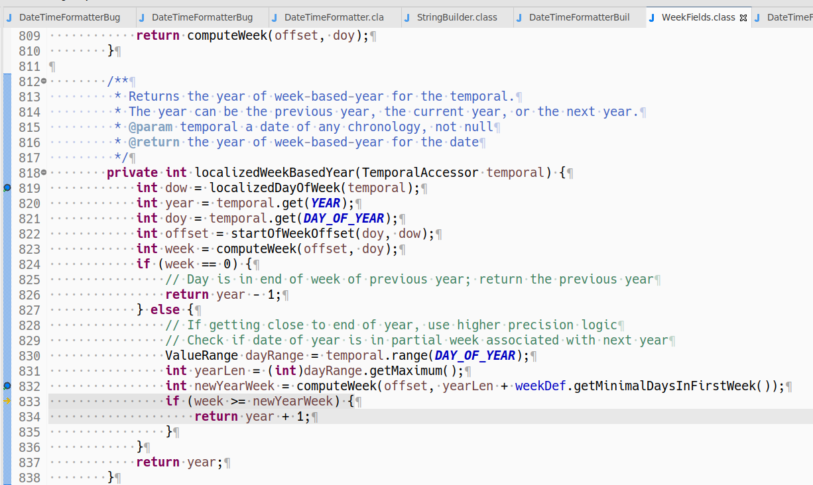
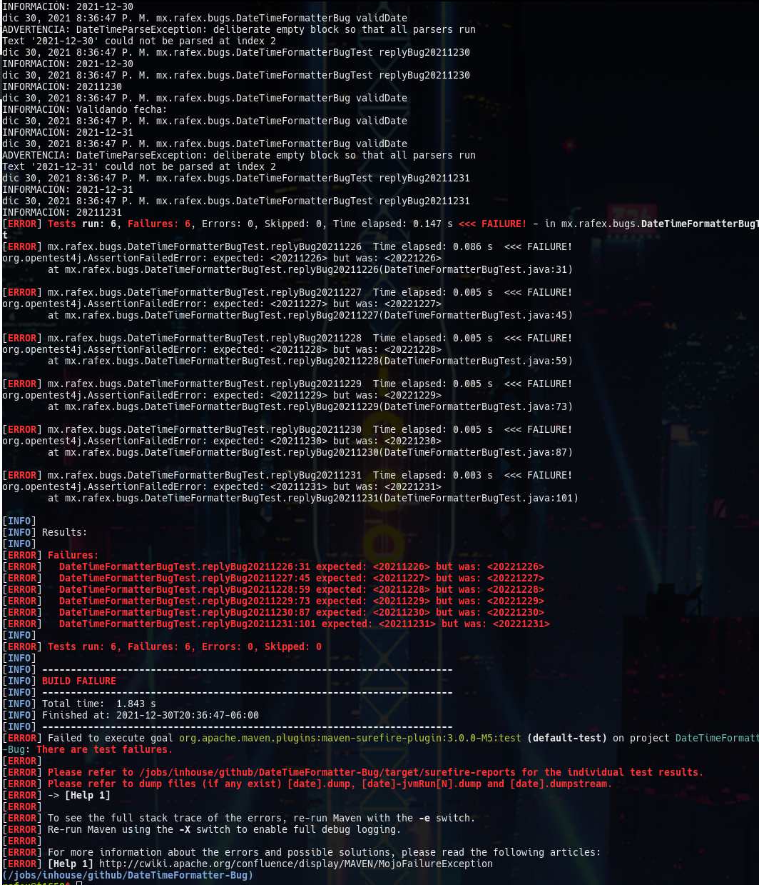

#Bug Java DateTimeFormatter

Hoy encontré un bug muy raro en #java la fecha del 2021-12-26 si usa un format YYYYMMdd la pasa a 20221226. Y solo pasa con los días 26, 27, 28, 29, 30 y 31 De diciembre de este año 2021

---

Today I found a very rare bug in #java the date of 2021-12-26 if you use a YYYYMMdd format it changes it to 20221226. And it only happens with the days 26, 27, 28, 29, 30 and 31 December of this year 2021


Ejecuta/Run

```Shell
mvn test
```

o/or

```Shell
./mvnw test
```




